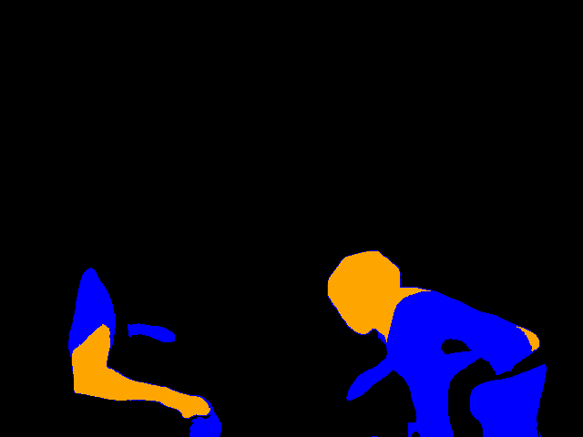

# FlowSeek Evaluation & Inference Guide

## OS Environment & Hardware

* **OS**: Ubuntu 20.04
* **GPU**: NVIDIA RTX 5060 Ti (sm_120)

---

## Conda Environment Setup

### 1. Create Conda Environment

```bash
conda create -n flowseek python=3.10 -y
conda activate flowseek
```

---

### 2. Install PyTorch (CUDA 12.8)

```bash
pip install torch==2.10.0 torchvision torchaudio \
  --index-url https://download.pytorch.org/whl/cu128
```

---

### 3. Install xFormers

```bash
pip install xformers
```

---

### 4. Install Other Dependencies

> **Note**: Remove conflicting packages (e.g. `torch`) if already installed.

```bash
pip install -r requirements.txt
```

---

## Download Pretrained Models

### Depth Anything V2 (ViT-S)

```bash
wget https://huggingface.co/depth-anything/Depth-Anything-V2-Small/resolve/main/depth_anything_v2_vits.pth
```

---

### FlowSeek-T-CT Weights

```bash
gdown --fuzzy "https://drive.google.com/file/d/1COOQFkMulzpBm4zMoWsaRGk7E3YcVr2I/view"
```

---

## Code Modification (Required for sm_120)

Modify the following file:

```
flowseek/core/depth_anything_v2/dinov2_layers/attention.py
```

Replace `MemEffAttention` with:

```python
class MemEffAttention(Attention):
    def forward(self, x: Tensor, attn_bias=None) -> Tensor:
        if not XFORMERS_AVAILABLE:
            assert attn_bias is None, "xFormers is required for nested tensors usage"
            return super().forward(x)

        B, N, C = x.shape
        qkv = self.qkv(x).reshape(B, N, 3, self.num_heads, C // self.num_heads)

        q, k, v = unbind(qkv, 2)

        q_half = q.to(dtype=torch.float16)
        k_half = k.to(dtype=torch.float16)
        v_half = v.to(dtype=torch.float16)

        with autocast(device_type="cuda", dtype=torch.float16):
            x = memory_efficient_attention(
                q_half, k_half, v_half, attn_bias=attn_bias
            )

        x = x.to(torch.float32).reshape(B, N, C)
        x = self.proj(x)
        x = self.proj_drop(x)
        return x
```

---

## Dataset

* **Dataset**: KITTI Scene Flow
* **Download**: [https://www.cvlibs.net/datasets/kitti/eval_scene_flow.php?benchmark=flow](https://www.cvlibs.net/datasets/kitti/eval_scene_flow.php?benchmark=flow)

Place the dataset under:

```
flowseek/data/KITTI
```

---

## Evaluation

```bash
python evaluate.py \
  --cfg config/eval/flowseek-T.json \
  --model weights/flowseek_T_CT.pth \
  --dataset kitti
```

---

## Inference on Other Datasets

* **Input**: Two RGB images
* **Output**: Optical flow visualization
* **Environment**: `flowseek` conda environment

### Example (TUM RGB-D)

```bash
python inference_tum.py \
  --img1 /home/lab605/dataset/TUM/rgbd_dataset_freiburg3_walking_halfsphere/rgb/1341846434.710184.png \
  --img2 /home/lab605/dataset/TUM/rgbd_dataset_freiburg3_walking_halfsphere/rgb/1341846434.746225.png
```

---

## Result Visualization

The optical flow is computed from **Image 1 → Image 2**.

|                             Image 1                             |                             Image 2                             |
| :-------------------------------------------------------------: | :-------------------------------------------------------------: |
|  |  |
|                        result flow (iter4)                      |                       result flow (iter12)                      |
|  |  |
|                        heat map (iter4)                    |                       heat map (iter12)                       |
|  |  |

